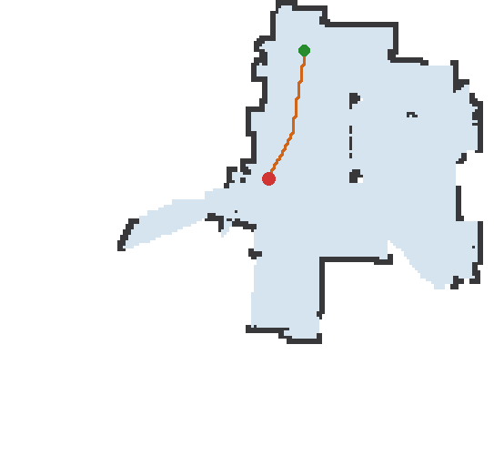
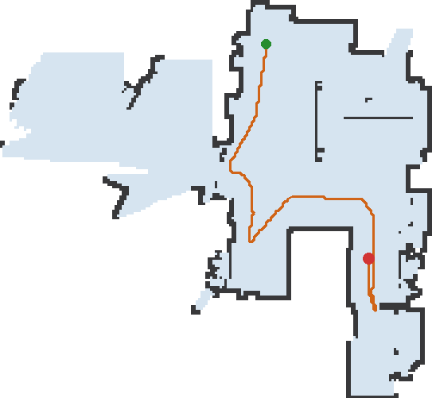

# Anatomy of the Q10 map stream — protocol 301

> **As of:** 2026-06-16 · Q10 S5+ (`roborock.vacuum.ss07`, B01) · firmware 03.11.24 · decoded from the
> live "build a new map" capture of session **s26** (map `<map-id>`; real room names redacted).
> Unofficial, reverse-engineered. Confidence per row: ✅ confirmed · 🟡 inferred · ⬜ unknown.

*This is a drill-down. The protocol-reference hub — with the confidence key and the method — is [PROTOCOL.md](PROTOCOL.md).*

## Where this binary sits

The Q10 is **cloud-only**: every command and every map frame is relayed through Roborock's MQTT broker.
The device's *output topic* is broadcast to any subscribed client (the phone app — and our single-connection tap).

That output topic carries two protocols:

- **protocol 102** — JSON data-point updates (status, settings, …).
- **protocol 301** — spontaneous **binary MAP frames**, with two sub-types keyed by the first two bytes:
  - **`0101`** = room / occupancy **grid** (streams even while docked),
  - **`0201`** = cleaning **path** (streams only during an active run).

At a glance, the two sub-types are laid out like this (byte offsets above each field; not to scale —
the authoritative per-field detail is in the two tables further down):

This page decodes both, using the frames the robot emitted while it built a brand-new map from scratch.

## The map building itself

The robot emitted **89 grid (`0101`) frames** and **60 path (`0201`) frames** for this map. We show three
grid slices (and each one's concurrent path slice). The three panels are placed in the **final map's
coordinate frame** so the robot's path is continuous across them — each panel's *content* is still exactly
what that one frame decodes to (nothing added or removed; labels appear only where the binary carries room
records).

| | | |
|:---:|:---:|:---:|
|  |  |  |
| **grid `0101` #3 of 89** (t≈21:06:51) | **grid `0101` #17 of 89** (t≈21:07:54) | **grid `0101` #89 of 89** (t≈21:25:24) |
| header **134 × 126** px · **0 room records** (unsegmented) | header **182 × 168** px · **0 room records** | header **181 × 167** px · **3 room records** |
| + path `0201` #7 of 60 · **48 pts** | + path `0201` #27 of 60 · **209 pts** | + path `0201` #60 of 60 · **406 pts** |

🟢 start (≈ dock) · 🔴 robot position (last path point) · orange line = cleaning path. The grid's own
dimensions grow (134×126 → 182×168 → 181×167) and room segmentation only appears in the final frames —
which is why the first two panels are unlabeled.

## How to decode it (the concrete steps)

### `0101` — room / occupancy grid

1. Confirm bytes **0–1** = `01 01`.
2. `map_id` = BE u32 at bytes **2–5** (identifies the map). `width` = BE u16 at bytes **7–8**;
   `height` = BE u16 at bytes **9–10**.
3. `declared_size` = BE u16 at **25–26**; `compressed_size` = BE u16 at **27–28**.
4. **LZ4-decompress** `frame[29 : 29 + compressed_size]`, telling the decompressor the uncompressed size is
   `declared_size`. Result = `out` (`declared_size` bytes). *It is a raw LZ4 **block** (no LZ4 frame header)
   — use a block/raw decompressor with the known output size, e.g. Python `lz4.block.decompress(blob,
   uncompressed_size=declared_size)`.*
5. **Occupancy grid** = the first `width × height` bytes of `out`, row-major (`out[row*width + col]`). Each
   cell value `v`: **`243` = outside/unmapped**, **`249` = wall**, otherwise `v % 4 == 0` and
   **`room_id = v // 4`** (floor). An unsegmented map uses a single placeholder floor id (here `60`).
6. **Room records** = the bytes *after* the grid (`out[width*height :]`). This tail is **always**
   `[0x01, count]` followed by `count` × **47-byte** records. **`count = 0` (a 2-byte `01 00` tail) =
   unsegmented**, so `declared_size = width×height + 2` for an unsegmented map (panels A/B) and
   `+ 2 + count×47` once rooms exist. Each 47-byte record: `room_id` = BE u16 at bytes **0–1**;
   `name_length` = byte **26**; `name` = bytes **27 … 27+name_length** (UTF-8). Bytes **2–25** are
   order/type hints + padding (🟡 not fully decoded).

### `0201` — cleaning path

7. Confirm bytes **0–1** = `02 01`. `point_count` = BE u16 at bytes **8–9**.
8. **Points** = BE **int16** `(x, y)` **mm** pairs starting at byte **16**, read to the end of the frame.
   Read whole 4-byte pairs and **ignore a trailing remainder of ≤ 2 bytes**. ⚠️ The header `point_count`
   can read **one higher** than the pairs actually present (this frame: count = 407, but 406 pairs +
   2 spare bytes). **Do not shift the start offset to "fix" the count** — byte 16 is correct (its points
   land **≈100 %** on floor cells once georeferenced — see the georeference worked example below).
   Last point = current robot position;
   first ≈ dock. *Some firmware prepends one spurious `~(0, −1907)` point — drop `points[0]` only if its
   step to `points[1]` exceeds **20× the median step** of the path (a deterministic band-aid). The
   sentinel's meaning, and how to detect the firmware era from the frame, are both unresolved — we have
   sentinel samples on `clean_counter` (byte 3) eras `0x08`/`0x11`, but not e.g. `0x1d`.*

### Georeference — overlaying a path on a grid

9. A path point `(x, y)` mm → grid cell: **`col = (y − oy) // res`, `row = (ox − x) // res`**, with
   **`res = 20` mm/px** (note the 90° map: grid **col** comes from path **y**, grid **row** from path
   **x**, and the row axis is **inverted**). The origin `(ox, oy)` is **not** in the frame. Recover it by **auto-fit**: choose the `(ox, oy)` that lands the most path
   points on floor cells. For a multi-frame run, fit once on the largest frame and align the others by grid
   overlap — that is exactly what makes the three panels above share a single coordinate frame. *(Worked
   example: on the s26 capture the fit recovered **`ox = 1001`, `oy = −3307` mm** — these are
   `decode_map.py`'s `GRID_ORIGIN_OX` / `GRID_ORIGIN_OY`; mind the sign, `oy` is **negative** in this
   `col = (y − oy)` convention — and it landed **99.87 %** of path points on floor cells. Those constants
   are **per install** — dock-anchored, stable until the dock moves or the map is reset — not universal;
   re-fit for your own home.)* ✅

## `0101` grid-frame header — field reference

| Bytes | Field | Type | Conf | What we know |
|---|---|---|:---:|---|
| 0–1 | `sub_type` = `0x0101` | u16 BE | ✅ | Grid-frame magic. Path frames use `0x0201`. |
| 2–5 | `map_id` | u32 BE | ✅ | Per-map id. Constant for a given map ⇒ it identifies the map, not geometry. Redacted here as `<map-id>`. |
| 6 | `map_segmented` flag | u8 | 🟡 | **`0` while the map is still building (unsegmented), `1` once it's finalized into rooms.** Verified `byte6==1 ⟺ rooms>0` on **89/89** frames of this build (it flips the instant the 3 room records appear). Earlier captures only ever saw *built* maps, so it looked like a constant `0x01`. |
| 7–8 | `width` | u16 BE | ✅ | Grid width px. Verified `==` empirical row-stride on 424/424 frames (s25). *(Historical: reading these as **LE** at `bytes[8:10]` gave a spurious `478` — the same bytes mis-offset + mis-endianned, not a separate field; the correct read is BE at `[7:9]`/`[9:11]`.)* |
| 9–10 | `height` | u16 BE | ✅ | Grid height px. |
| 11–24 | header block | 14 B | 🟡 | **No bounding-box / origin is encoded here** (exhaustive search, s25). Observed sub-structure: `[11]=0x04` (steady state; `0x00`/`0x02` in the first few tiny build frames) · `[12–13]=0x6901` per-map · `[14] ≈ 10×height` · `[15]=0` · `[16]=0x05` const · `[17]` session/mode flag · `[18–21]` per-frame scan-progress counter · `[22]` per-frame · `[23–24]=0`. |
| 25–26 | `declared_size` | u16 BE | ✅ | Decompressed size = `width × height` + trailing room records. |
| 27–28 | `compressed_size` | u16 BE | ✅ | LZ4 block length, bytes. |
| 29 … | `lz4_block` | LZ4 block | ✅ | Decompresses to the occupancy grid + room records — see decode steps 4–6. |

## `0201` path-frame header — field reference

| Bytes | Field | Type | Conf | What we know |
|---|---|---|:---:|---|
| 0–1 | `sub_type` = `0x0201` | u16 BE | ✅ | Path-frame magic. |
| 2 | unknown | u8 | ⬜ | One sub-header byte. |
| 3 | `clean_counter` | u8 | 🟡 | Per-clean counter (`0x08` / `0x11` eras seen); not a structure flag. |
| 4–7 | unknown | 4 B | ⬜ | Four bytes. |
| 8–9 | `point_count` | u16 BE | ✅ | Number of path points. ⚠️ may read **one higher** than the pairs actually present (see decode step 8). |
| 10–15 | header tail | 6 B | ⬜ | Six bytes; completes the 16-byte header. |
| 16 … | `points` | int16[] (x,y) | ✅ | BE int16 (x, y) mm pairs (read to end; ignore a ≤2-byte remainder; **don't** shift the offset — byte 16 georeferences ≈100 %; byte 14 → ~91 %, byte 18 also transposes). Last = robot position; first ≈ dock. 0x11+ firmware prepends a spurious `~(0, −1907)` sentinel (stripped; meaning unknown). |

## Open questions (visible in this very capture)

- **The map origin is not transmitted** — it has to be auto-fit (step 9). Whether it lives in the cloud/102
  channel instead is unresolved.
- **The `~(0, −1907)` path sentinel** (0x11+ firmware) is band-aided away, not understood.
- **Bytes `11–24`** carry a scan-progress counter and several constants, but no geometry we can use yet.
