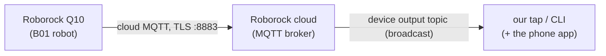

# Anatomy of the Q10 map stream — protocol 301

> **As of:** 2026-06-22 · Q10 S5+ (`roborock.vacuum.ss07`, B01) · firmware 03.11.24 · decoded from the
> live "build a new map" capture (map `<map-id>`; real room names redacted).
> Unofficial, reverse-engineered. Confidence per row: ✅ confirmed · 🟡 inferred · ⬜ unknown.

*This is a drill-down. The protocol-reference hub — with the confidence key and the method — is [PROTOCOL.md](PROTOCOL.md).*

## Where this binary sits

The Q10 is **cloud-only**: every command and every map frame is relayed through Roborock's MQTT broker.
The device's *output topic* is broadcast to any subscribed client (the phone app — and our single-connection tap).



That output topic carries two protocols:

- **protocol 102** — JSON data-point updates (status, settings, …).
- **protocol 301** — spontaneous **binary MAP frames**, with two sub-types keyed by the first two bytes:
  - **`0101`** = room / occupancy **grid** (streams even while docked),
  - **`0201`** = cleaning **path** (streams during a clean or active navigation),
  - **`0301`** = full-map alternate/master grid layer (same `0101` codec: LZ4 grid + room records). ✅
  - **`0401`** = per-room sub-grids (small per-room bounding boxes, same `0101` codec). ✅

At a glance, the two sub-types are laid out like this (byte offsets above each field; not to scale —
the authoritative per-field detail is in the two tables further down):


This page decodes both, using the frames the robot emitted while it built a brand-new map from scratch.

## The map building itself

The robot emitted **89 grid (`0101`) frames** and **60 path (`0201`) frames** for this map. We show three
grid slices (and each one's concurrent path slice). The three panels are placed in the **final map's
coordinate frame** so the robot's path is continuous across them — each panel's *content* is still exactly
what that one frame decodes to (nothing added or removed; labels appear only where the binary carries room
records).

| | | |
|:---:|:---:|:---:|
|  |  |  |
| **grid `0101` #3 of 89** (t≈21:06:51) | **grid `0101` #17 of 89** (t≈21:07:54) | **grid `0101` #89 of 89** (t≈21:25:24) |
| header **134 × 126** px · **0 room records** (unsegmented) | header **182 × 168** px · **0 room records** | header **181 × 167** px · **3 room records** |
| + path `0201` #7 of 60 · **48 pts** | + path `0201` #27 of 60 · **209 pts** | + path `0201` #60 of 60 · **406 pts** |

🟢 start (≈ dock) · 🔴 robot position (last path point) · orange line = cleaning path. The grid's own
dimensions grow (134×126 → 182×168 → 181×167) and room segmentation only appears in the final frames —
which is why the first two panels are unlabeled.

## How to decode it (the concrete steps)

**Shortcut — parse it with Kaitai.** [`frames.ksy`](frames.ksy) is a [Kaitai Struct](https://kaitai.io) spec for the
raw 301 frame (both `0101` and `0201`). Compile it and parse your own `vac.py watch --bytes` captures without
hand-writing the offsets:

```bash
kaitai-struct-compiler -t python frames.ksy # → roborock_b01_301.py
```
```python
from roborock_b01_301 import RoborockB01301
f = RoborockB01301.from_bytes(raw_301_payload) # one payload from `vac.py watch --bytes`
# 0101 grid frame:
print(f.body.width, f.body.height) # grid dims; LZ4 body in f.body.lz4_body
```

The LZ4 grid body is decompressed externally (`pixel // 4 = room_id`, 243 = outside, 249 = wall). The manual
byte-by-byte walkthrough below is the same layout, spelled out.

### `0101` — room / occupancy grid

1. Confirm bytes **0–1** = `01 01`.
2. `map_id` = BE u32 at bytes **2–5** (identifies the map). `width` = BE u16 at bytes **7–8**;
   `height` = BE u16 at bytes **9–10**.
3. `declared_size` = BE u16 at **25–26**; `compressed_size` = BE u16 at **27–28**.
4. **LZ4-decompress** `frame[29 : 29 + compressed_size]`, telling the decompressor the uncompressed size is
   `declared_size`. Result = `out` (`declared_size` bytes). *It is a raw LZ4 **block** (no LZ4 frame header)
   — use a block/raw decompressor with the known output size, e.g. Python `lz4.block.decompress(blob,
   uncompressed_size=declared_size)`.*
5. **Occupancy grid** = the first `width × height` bytes of `out`, row-major (`out[row*width + col]`). Each
   cell value `v`: **`243` = outside/unmapped**, **`249` = wall**, otherwise `v % 4 == 0` and
   **`room_id = v // 4`** (floor). An unsegmented map uses a single placeholder floor id (here `60`).
6. **Room records** = the bytes *after* the grid (`out[width*height :]`). This tail is **always**
   `[0x01, count]` followed by `count` × **47-byte** records. **`count = 0` (a 2-byte `01 00` tail) =
   unsegmented**, so `declared_size = width×height + 2` for an unsegmented map (panels A/B) and
   `+ 2 + count×47` once rooms exist. Each 47-byte record: `room_id` = BE u16 at bytes **0–1**;
   `name_length` = byte **26**; `name` = bytes **27 … 27+name_length** (UTF-8). Bytes **2–25** are
   order/type hints + padding (🟡 not fully decoded).

### `0201` — cleaning path

7. Confirm bytes **0–1** = `02 01`. `point_count` = BE u16 at bytes **8–9**.
8. **Points** = BE **int16** `(x, y)` **path-unit** pairs (≈2.5 mm/unit, not true mm) starting at **byte 14**
   (`pose_extract.py`; verified exact across 850/850 teleop frames). Read whole 4-byte pairs to end of frame;
   ignore a ≤2-byte trailing remainder. Last point = current robot position; first ≈ dock.
   - **Stray leading point.** Some autonomous dock-rooted cleans **prepend one extra point ≈ the map origin**
     (e.g. `(−3, 0)`), which then jumps ~1800–4200 path-units to the real first point. It is real (present in
     the byte-14 data, counted in `point_count`) and **absent on teleop/heartbeat and map-builds**. Drop
     `points[0]` only when its step to `points[1]` is a gross outlier (>20× the median step), so a genuine
     first point is never lost. What triggers it (clean mode / resume?) is unresolved.

   - ⚠ `decode_map.py:parse_path` historically reads points from **byte 16** (a render-path legacy — the
     count then reads one high; flagged for refactor). Use **byte 14** for pose/heading, and `path_to_pixel`
     to place a point on the grid (step 9).


### Georeference — overlaying a path on a grid

9. **Path point → grid cell** (one orientation): `col = (x − oy) // res`, `row = (ox − y) // res` — column from
   x, row from y (Y inverted): a per-axis scale + Y-flip. This is `decode_map.path_to_pixel`, the same form as
   upstream `python-roborock`'s `GridCalibration.world_to_pixel` (v5.18.0: `px = x/res + origin_x`,
   `py = origin_y − y_sign·y/res`), which **fits** `res`/`origin`/`y_sign` by on-floor overlap (so for a *new
   home*, fitting — our auto-fit fallback below — is the robust path; the header origin seeds/validates it).
   - `decode_map.coord_to_pixel` uses the **app's display orientation** (column from y), paired with
     `parse_path`'s byte-16 render coords — a self-consistent legacy pair the overlay renderer uses. Place a
     **true (byte-14) pose** with `path_to_pixel`, not `coord_to_pixel`.

   **Determinism & the renderer's fallback.** This orientation is a **validated convention** for this device — it never varies in the corpus (**3,726/3,726** single-map path frames register in the `(y,x)` standard; every apparent deviation was a cross-map mis-pairing in a capture spanning a *map reset*, not the data flipping) — **but it is not read from any header field** (no byte co-varies with it). So `map_render.py` uses the read header-standard by default and, ONLY when that lands few path points on floor (an unseen home / firmware / re-oriented map), **fits orientation+origin by on-floor** (`decode_map.fit_registration`: the 8 axis-aligned orientations × translation, picked conservatively by margin — exactly upstream `solve_calibration`'s posture, with resolution fixed at the read value). A deviating map thus auto-recovers, or is flagged by the per-run on-floor self-check — never silently mis-rendered. *(Whether a header byte latently encodes orientation is untested — closeable only with a deliberately re-oriented map; see CAPABILITIES.)*

   Both use **`res = 20` path-units/px (≈50 mm/px)**. The origin **IS** transmitted in the `0101` header: `x_min` at bytes 11–12 and `y_min` at bytes 13–14 (both **raw BE**, in 5 mm header-units = 2 path-units each). ✅ The map-unit→path-unit reconciliation is **DONE**: `decode_map.py` now reads the origin straight from the header (`origin_from_header`, transform **`ox = 2·y_min`, `oy = −2·x_min`** — each header unit is 5 mm = 2 path-units, so the transform multiplies the **raw** by 2; `fit_method="header"`). The cross-mapping — `ox` from `y_min`, `oy` from `x_min` — is **not a typo**: the header's coordinate frame is rotated 90° from the path frame (header-X ↔ path−Y, header-Y ↔ path-X). **Auto-fit is retained only as a fallback / cross-check** — it lands at on-floor parity with the header origin (29/31 captures; `test_decode_map` 6/6). The auto-fit fallback, for reference: choose the `(ox, oy)` that lands the most path points on floor cells. For a multi-frame run, fit once on the largest frame and align the others by grid overlap — that is exactly what makes the three panels above share a single coordinate frame. *(Worked example: on this capture the fit recovered **`ox = 1001`, `oy = −3307` (path-units)** — the **auto-fit fallback's** values (`decode_map.py`'s former `GRID_ORIGIN_OX/OY` defaults); they only *approximate* the header transform `ox = 2·y_min` (auto-fit optimizes on-floor landing, not the exact origin). Mind the sign, `oy` is **negative** in this `col = (y − oy)` convention — and it landed **99.87 %** of path points on floor cells. Those constants are **per install** — dock-anchored, stable until the dock moves or the map is reset — not universal — though `decode_map` now reads them straight from the header, so this fallback only matters if the header read is unavailable.)* ✅

## `0101` grid-frame header — field reference

| Bytes | Field | Type | Conf | What we know |
|---|---|---|:---:|---|
| 0–1 | `sub_type` = `0x0101` | u16 BE | ✅ | Grid-frame magic. Path frames use `0x0201`. |
| 2–5 | `map_id` | u32 BE | ✅ | Per-map id. Constant for a given map ⇒ it identifies the map, not geometry. Redacted here as `<map-id>`. |
| 6 | `map_segmented` flag | u8 | 🟡 | **`0` while the map is still building (unsegmented), `1` once it's finalized into rooms.** Verified `byte6==1 ⟺ rooms>0` on **89/89** frames of this build (it flips the instant the 3 room records appear). Earlier captures only ever saw *built* maps, so it looked like a constant `0x01`. |
| 7–8 | `width` | u16 BE | ✅ | Grid width px. Verified `==` empirical row-stride on 424/424 frames. *(Historical: reading these as **LE** at `bytes[8:10]` gave a spurious `478` — the same bytes mis-offset + mis-endianned, not a separate field; the correct read is BE at `[7:9]`/`[9:11]`.)* |
| 9–10 | `height` | u16 BE | ✅ | Grid height px. |
| 11–12 | `x_min` | BE | ✅ | Map origin X — **raw in 5 mm header-units** (1 unit = 2 path-units). Per-map constant; differs across maps. `decode_map.py` reads it via `origin_from_header` — transform to path-units **`oy = −2·x_min`** (the raw value ×2); auto-fit is the fallback. |
| 13–14 | `y_min` | BE | ✅ | Map origin Y — raw in 5 mm header-units. Per-map constant. Read with `x_min`: **`ox = 2·y_min`** (raw ×2). |
| 15–16 | `resolution` | u16 BE, /100 m/px | ✅ | Always `5` → 0.05 m/px = **50 mm/px** (matches the known grid resolution). |
| 17–18 | `charge_x` | u16 BE | ✅ | Dock/charge-station X — same header units as `x_min`; `charge_x − x_min` = dock position relative to the origin. |
| 19–20 | `charge_y` | u16 BE | ✅ | Dock/charge-station Y — same units as `y_min` (read with `charge_x`). |
| 21–22 | `charge_phi` | BE, negated | ✅ | Dock heading, degrees (negate the raw value). |
| 23–24 | declared_size high u16 | u16 BE | 🟡 | High 16 bits of a u32 declared-size; observed as `0x0000`. Low u16 is `declared_size` at bytes 25–26. |
| 25–26 | `declared_size` | u16 BE | ✅ | Decompressed size = `width × height` + trailing room records. |
| 27–28 | `compressed_size` | u16 BE | ✅ | LZ4 block length, bytes. |
| 29 … | `lz4_block` | LZ4 block | ✅ | Decompresses to the occupancy grid + room records — see decode steps 4–6. |

## `0201` path-frame header — field reference

| Bytes | Field | Type | Conf | What we know |
|---|---|---|:---:|---|
| 0–1 | `sub_type` = `0x0201` | u16 BE | ✅ | Path-frame magic. |
| 2–3 | `path_epoch` | u16 BE | ✅ | Path-epoch counter: resets on power-cycle, **+1 per new traversal** (undock / relocalize / clean-start). A skip >1 ⇒ the robot moved while uncaptured. (The old "byte-3 `clean_counter`" `0x08`/`0x11` were just the low byte at epochs 8/17.) |
| 4–7 | const `0x00020000` | 4 B | ✅ | Constant across 3,440 path frames. Semantics unnamed. |
| 8–9 | `point_count` | u16 BE | ✅ | Number of path points. ⚠️ may read **one higher** than the pairs actually present (see decode step 8). |
| 10–11 | `heading_deg` | i16 BE | ✅ | **Live firmware SLAM heading, degrees** (`0`=+x, `+90`=+y, `±180`=−x, `−90`=−y) — this header field IS the "missing heading DP". **Accuracy by regime: drive-mode 1–2°** (deliberate long straight runs, `heading_probe.py`, 2026-06-22); **teleop 8.7° mae** (offline heading analysis, 48 motion / 17 turn frames — *tracks* the path tangent through TURNS, vs 66–95° for every other offset); **clean-mode per-frame heading diverges from the accumulated-path tangent (~18–52°, capture-dependent)** — but this isn't bad sensor data: it's an *instantaneous* heading sampled while the robot is actively maneuvering (sweeping/turning), compared against a 2400-pt *accumulated* path, so it's simply **not a tight-validation regime**. **NB the official Roborock app does NOT read this field — it recomputes heading from path geometry (atan2 of the last 2 path points); we use the firmware field directly for closed-loop nav.** A localization loss (FAULT 556) snaps it to **0°** with the pose at ≈(0,0). |
| 12–13 | const `0x0000` | 2 B | ✅ | Constant across 3,440 path frames. Semantics unnamed. |
| 14 … | `points` | int16[] (x,y) | ✅ | BE int16 (x, y) **path-unit** pairs (≈2.5 mm/unit) starting at **byte 14** (`pose_extract.py`; exact count 850/850 teleop frames). Read whole pairs to end; ignore a ≤2-byte remainder. Last = robot position; first ≈ dock. `decode_map.py:parse_path` historically reads from **byte 16** (a render-path legacy — count then reads one high; flagged for refactor; use byte 14 + `path_to_pixel`). Some autonomous dock-rooted cleans **prepend one stray leading point ≈ the map origin** (counted in `point_count`; absent on teleop/heartbeat and map-builds) — drop it via the gross-outlier rule (step 8). |

## Open questions (visible in this very capture)

- ~~**The map origin is not transmitted**~~ — **RESOLVED (independently verified):** the origin IS encoded in the `0101` header at bytes 11–14 (`x_min`/`y_min`, **raw BE, 5 mm units = 2 path-units**); `resolution` is at 15–16 (always 5 = 50 mm/px); dock coords at 17–22. `decode_map.py` reads the origin straight from the header (`origin_from_header`, transform `ox = 2·y_min`, `oy = −2·x_min`); **auto-fit is now only a fallback / cross-check** (on-floor parity with the header origin, 29/31 captures). ✅
- **The `pts[0]` ≈map-origin sentinel** — **characterized 2026-06-21** (constant, tracks the map origin; on some dock-rooted cleans, absent in map-builds + teleop; both decoders handle it — `decode_map` strips it, `pose_extract` uses the last point; reconciles with the PoC's offset-18). Exact per-frame trigger unpinned — cosmetic.
- **~~Bytes `11–24`~~ — mostly RESOLVED (2026-06-20):** the 0201 header is now decoded — epoch (2–3),
  const (4–7), count (8–9), **heading (10–11)**, const (12–13); see the header table above. No remaining
  unknown header geometry before the points.
