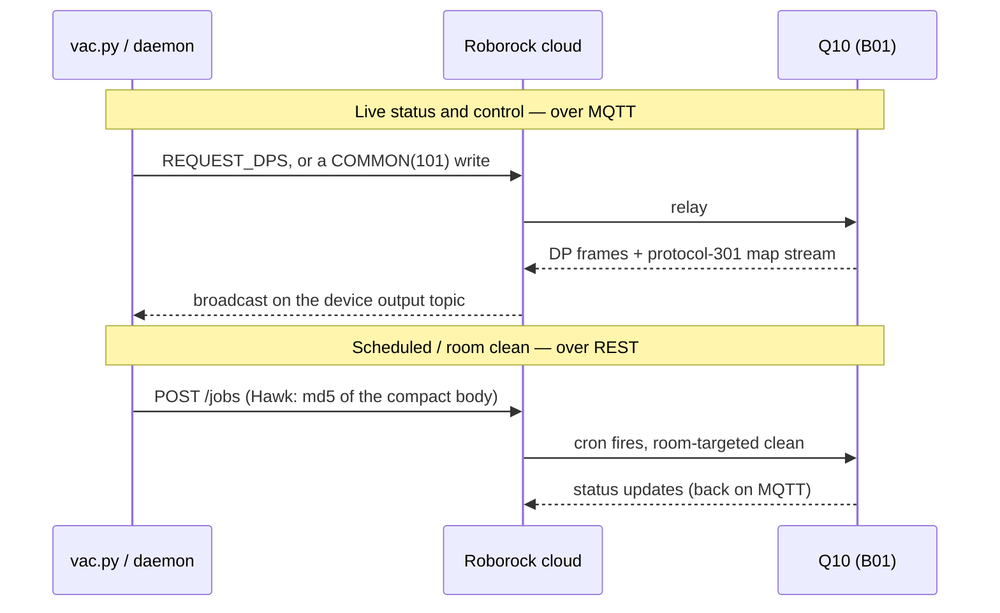

# Roborock Q10 (B01) cloud protocol — reverse-engineering reference

> **As of:** 2026-06-19 · **Hardware:** Roborock Q10 S5+ (`roborock.vacuum.ss07`, B01 protocol), firmware
> **03.11.24** · **Stack:** `python-roborock` 5.14.2, Python 3.11 · **Method:** on-device HTTPS proxy +
> single-connection MQTT tap, then **observing the app's own traffic in an Android emulator** that unlocked the
> write surface — see [Method & provenance](#method--provenance).
>
> This is an **unofficial, reverse-engineered** reference — not a vendor spec. Findings are **best-effort and
> due-diligence as of the date above**; behaviour may differ on other models or firmware. Every claim carries a
> confidence tier (below). Corrections and contradictions are welcome — see [Open questions](#open-questions).

This page is the **readable hub**. The detailed tables live in their own files and are linked as drill-downs:
- **[DP_DICTIONARY.md](DP_DICTIONARY.md)** — every data-point: meaning + decoded wire format + confidence.
- **[CAPABILITIES.md](CAPABILITIES.md)** — every interaction, scoped can / can't / unknown.
- **[frames.ksy](frames.ksy)** — machine-readable Kaitai schema for the map-frame headers (drop your own
  capture into the [Kaitai Web IDE](https://ide.kaitai.io/) to verify/extend against your device).

## Confidence key

Every entry in this reference and the linked tables is tagged:

| Tier | Meaning |
|---|---|
| ✅ **Confirmed** | Round-trip or behavioural proof on our hardware/firmware (cited session). |
| 🟡 **Plausible** | Inferred from protocol structure or analogy; no counter-evidence, not independently triggered. |
| ❓ **Reported** | From a third-party project/source (cited); **not** independently verified here. |
| ⬜ **Unknown** | Observed but semantics undetermined. |

Confirmed entries also carry a **firmware anchor** (e.g. `fw 03.11.24`) — that's both the proof
and the staleness signal: if your firmware is newer, treat it as advisory.

## Overview

The Q10 S5+ is a **"B01" device: cloud-only.** There is no local-network control path (confirmed); every
command is relayed through Roborock's cloud over **MQTT**, with a
**REST** API for onboarding, schedules, and one-time room cleans. The live map/path arrives as a spontaneous
binary **MQTT protocol-301** stream while cleaning. ✅ `fw 03.11.24`

## Key findings (the durable contributions)

If you're implementing a B01 client in another language, start here — the reusable results, each linked to its detail:

1. **Stored settings, zones, walls, and manual drive ARE settable — via the string-key COMMON(101) envelope.**
   `command.send(COMMON, {str(code): value})` (the exact shape the app uses) makes them *stick*. An earlier
   interpretation found writes seemed to revert; that was a wrong **inner-key** wire bug, not server authority — the
   CLI had been sending an enum-member key. → [Capabilities](CAPABILITIES.md) · [Data points](DP_DICTIONARY.md)
2. **Hawk *body*-signing unlocks `/jobs` writes.** Body-bearing POST/PUT must sign `md5(compact-JSON body)` (GET signs
   the path only) **and** send those exact bytes — the fix for schedules and one-time room cleans.
   → [Authentication](#authentication--hawk-and-the-write-path-body-signing) (filed upstream as #849)
3. **Hold ONE MQTT connection to dodge the account-level `135` lockout.** A fresh session per command trips a
   rate-limit that knocks out the phone app too; one long-lived connection (the daemon) sidesteps it.
   → [Transport](#transport)
4. **The live map/path is a spontaneous binary MQTT protocol-301 stream.** `0101` = LZ4 occupancy grid
   (`pixel // 4 = room_id`) + trailing room-name records; `0201` = the cleaning path; zone/wall coords are
   **~5 mm/unit**. → [Map frames](#map-frames-protocol-301) · [Frame anatomy](FRAME_ANATOMY.md)
5. **Live clean-history pulls work** — `COMMON{"52":{"op":"list"}}` returns the record list; the old "app/push-only"
   verdict was the same wrong-key envelope. → [Data points](DP_DICTIONARY.md)

## Transport

| Channel | Use | Confidence |
|---|---|---|
| **REST** (`api-us.roborock.com` / `usiot.roborock.com`) | onboarding, home/device data, `/jobs` (schedules + one-time room cleans) | ✅ |
| **MQTT** (cloud broker, TLS) | all live control + status; the device's output topic broadcasts to any subscribed client | ✅ |
| **MQTT protocol-301** (binary, spontaneous while cleaning) | map grid + cleaning path frames | ✅ |

<details><summary>The account-level <code>135</code> rate-limit (and why the daemon exists)</summary>

Many MQTT connections in a short window trip an account-level error **`135`** ("Not Authorized" on reconnect[^135]) that
locks out the CLI *and* the app. Holding **one** persistent connection sidesteps it — that's the single-connection
daemon. ✅. No other surveyed project treats 135 as a deliberate-avoidance design (see [CREDITS.md](CREDITS.md) for the landscape).
</details>

The two channels in action — a live read/control on MQTT, and a room clean scheduled over REST:



### Connection / session setup

Establishing the cloud session — account login (which yields the `rriot` credential bundle), the TLS
connection to the MQTT broker, and the broker-auth derivation — is the **generic Roborock cloud handshake,
not B01-specific.** This project builds on **python-roborock** for it rather than re-deriving it, and the
prior-art projects in [CREDITS.md](CREDITS.md) (dustcloud, XiaomiRobotVacuumProtocol) reverse-engineered that
login/broker layer years ago. **If you're porting to another language, that's where to get it** — it's out of
scope here, which is deliberately the B01-specific layer (DPs, the COMMON write envelope, protocol-301, Hawk).

The parts that *are* relevant once connected: control + status ride **MQTT over TLS on `:8883`**; replies —
including COMMON-envelope command results — land on the **sender's own output topic** `…/m/o/{client-id}`,
where `client-id = md5hex(rriot.u : rriot.k)[2:10]` (the same id the client subscribes to). That's why a
read-only tap needs no network interception: you already own the topic your own replies come back on.


## Authentication — Hawk, and the write-path body-signing

REST requests are **Hawk**-signed. The pre-string is seven colon-joined fields; the last is the **payload-hash
slot**. GET signs it empty (works); **body-bearing writes (POST/PUT) to `/jobs` must put `md5(compact-JSON
body)` there, and must SEND those exact compact bytes** — re-serialization with spaces breaks the MAC → `401`.
This is the body-signing rule for writes (schedules, room cleans). ✅ Filed upstream as [python-roborock#849](https://github.com/Python-roborock/python-roborock/issues/849).
GET and `DELETE /jobs/{id}` (no body) are unaffected.

```
prestr = u : s : nonce : ts : md5(path) : md5(sorted-params) : md5(compact-json body) # last slot empty for GET
```
*(Captured-evidence excerpt is retained internally; auth/identity is redacted before any of it is shown.)*

`/jobs` is the path for **scheduled** room cleans (and a per-param fallback); for an **immediate** room clean
the direct path is the MQTT segment-clean `START_CLEAN {cmd:2}` (no Hawk — see the DP table). The one-time
room-clean job body (captured from app traffic):

```
{ cron, repeated: false, enabled, param: { mapId, rooms:[…], roomCount,
  cleanMode, cleanRoute, fanLevel, waterLevel, cleanCount } }
```

⚠ The REST `fanLevel` enum differs from the MQTT fan enum at the top tier — treat it as its own scale, not the MQTT
one. To validate a `/jobs` write without moving the robot, post it `enabled: false` (the scheduler skips disabled
jobs, so it can't fire even if a delete races the cron).

## Data points (DP model)

State and control ride **`device.b01_q10_properties`** → `.command` / `.vacuum` / `.status` / `.remote`. DP
names + numeric codes are in `roborock/data/b01_q10/b01_q10_code_mappings.py` (`B01_Q10_DP`, plus the `YX*` value
enums). **The full decoded DP reference — meanings, payload formats, confidence — is [DP_DICTIONARY.md](DP_DICTIONARY.md)**
(~114 DPs; the most complete public B01-Q10 reference we're aware of). Highlights:
- Settings split: `fan`/`water`/`mode` **persist** (runtime params); `volume`/`child-lock`/`boost`/`DND`/dust/route/carpet
  are **settable via the string-key COMMON(101) envelope** ✅ — an earlier interpretation read them as server-owned;
  that was an enum-vs-string inner-key wire bug. Not universal: `BREAKPOINT_CLEAN`/`MAP_SAVE_SWITCH` don't stick even so.

- `FAULT` is **overloaded** — it also carries lifecycle codes (`8`=trapped, `400`=benign "starting clean"); a
  non-zero FAULT is not necessarily an error. ✅
- `CLEAN_RECORD` history is a 12-field underscore string; **our own `op:list` pulls it live** via string-key
  COMMON (reply on the sender's `/m/o/{clientid}/`) — 25 records, no MITM. ✅
- Multi-map: `MULTI_MAP` ops `list`/`update`(rename)/`select`; `MULTI_MAP_SWITCH=4` = multi-level on; map id ≈
  creation epoch. ✅

## Map frames (protocol-301)

**Full walkthrough — a map building itself, the decode pipeline, and typed per-byte field tables:
[FRAME_ANATOMY.md](FRAME_ANATOMY.md).** Header layout (machine-checked): [frames.ksy](frames.ksy).
Two sub-types, by the first 2 header bytes.
- **`0101` — room/occupancy grid.** LZ4-compressed. Grid **W/H read from the header** (`raw[7:9]`,`raw[9:11]`
  BE u16); `pixel//4=room_id`, `243`=outside, `249`=wall; trailing
  room-name records. ✅ Header byte `[6]` is a **map-segmented/finalized flag** (`0` while
  building, `1` once rooms exist). 🟡
- **`0201` — cleaning path.** BE int16 `(x,y)` **path-unit** pairs (≈2.5 mm/unit) after a 16-byte header; last point = robot position. ✅
- **Georeference** (path-units → grid pixel, ≈50 mm/px): the origin is **not transmitted**; we **auto-fit** it per capture
  (it's stable per home, anchored top-right, grows left/down). ✅ Others use manual-tune
  calibration. ❓ python-roborock PR #848 draft attempts an auto-fit too.

## Capabilities

Full scoped matrix (can / can't / unknown, per interaction) → **[CAPABILITIES.md](CAPABILITIES.md)**. In short:
reads + room-targeted cleaning + map/history decode + a single-connection daemon all work live; **virtual-wall (DP 56)
and no-go/no-mop zone (DP 54) SET are live-validated**, and most settings are settable via
string-key COMMON (a few — `BREAKPOINT_CLEAN`/`MAP_SAVE_SWITCH` — aren't). Manual drive (`REMOTE`) is CLI-validated.

## Open questions

Where we're uncertain or others disagree — **the high-value targets for anyone extending this** (data to test
against in the seed corpus, when published):
- **No-mop zone type code:** we observe **`0x02`** (ground-truthed); python-roborock PR #850
  reports **`0x03`**. Unresolved — possibly per-firmware or sub-types. ⬜ ❓ *Context (Reported):* the RRMapFile
  **file** format (marcelrv/XiaomiRobotVacuumProtocol) numbers these as separate *blocks* — no-go=9, virtual
  walls=10, no-mop=12 — a different encoding from the B01 **MQTT DP** `RESTRICTED_ZONE_UP` types, which is one
  reason type numbers don't cross-map cleanly between projects. Reconcile by comparing raw captures across homes.
- **Map origin in the cloud channel:** not in the 301 stream; may live in the on-demand map RPC / 102-JSON. ⬜
- ~~**`CLEAN_RECORD` live-pull trigger**~~ — **RESOLVED :** our own `op:list` returns the back-catalog
  (25 records) via string-key COMMON; no MITM needed. ✅
- **Unexplained DPs** seen on the `novel` tap but never decoded. ⬜
- The anomalous path `pts[0]` sentinel `(0,−1907)` (0x11+ firmware) — band-aided, intent unknown. ⬜

## Method & provenance

Every datapoint here is **"we used hardware H + method M → result R"**, then interpreted over the totality of
available information. Two methods were used: **(1)** an on-device HTTPS proxy (REST capture) + a single-connection
MQTT tap (the live DP + 301 stream), with a **timestamped operator log** so app-action → REST → MQTT → robot-state
align — the capture-RE + live-validation work of (2026-06-12 … 16); and **(2)observing the app's own
traffic in an Android emulator** (2026-06-18), which revealed the write-side wire format — the string-key
COMMON envelope and the full command surface — **without the network-level MQTT interception once thought necessary.**

So a ✅ on live behaviour traces to a specific supervised run, not a one-off guess.

**The former method ceiling — now crossed.** The proxy/output-tap techniques expose everything the robot
*broadcasts* and everything the app sends over *REST*, but not the app's MQTT *input* (write) commands — so as of
2026-06-16 the write surface (wall/zone/room SET, manual drive, the live-history trigger) sat behind that wall, and
crossing it was expected to need network-level MQTT interception. **We crossed it differently:** by observing the
app's own traffic in an emulator, we captured the full command surface — and the real unlock was
that those writes work over our *own* connection via the **string-key COMMON(101)** envelope (the prior "blocked
input topic" was a wrong-wire-format bug). Zone-SET, wall-SET, settings, and the live-history pull are now
CLI-validated; manual drive (`REMOTE`) is CLI-validated too.
Captured evidence is retained internally; published excerpts are scrubbed per the **privacy floor** (settings/
rooms/cron/timestamps clear; tokens/Hawk-creds/MAC/SSID/IP/email redacted; duid/serial/map-id placeholdered).

## Credits

Built on others' work — the full landscape + attribution is in **[CREDITS.md](CREDITS.md)**.
Notably: [python-roborock](https://github.com/Python-roborock/python-roborock) (the library); the
[HA Roborock integration](https://www.home-assistant.io/integrations/roborock/) (the single-connection coordinator
pattern); [v1b3c0d3x3r/roborock-qseries-map-bridge](https://github.com/v1b3c0d3x3r/roborock-qseries-map-bridge)
(B01 map decode); the [openHAB Roborock binding](https://github.com/openhab/openhab-addons) (clean-record + status
tables); [marcelrv/XiaomiRobotVacuumProtocol](https://github.com/marcelrv/XiaomiRobotVacuumProtocol) and Dennis
Giese / [dustcloud](https://github.com/dgiese/dustcloud) (the RE lineage).

[^135]: `135` is MQTT5 return code `0x87` "Not Authorized" on reconnect-storm, not purely a rate-limit — but holding one connection still avoids it.
