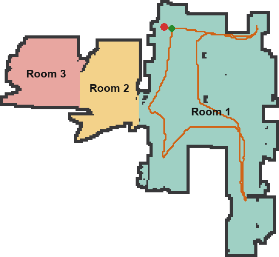
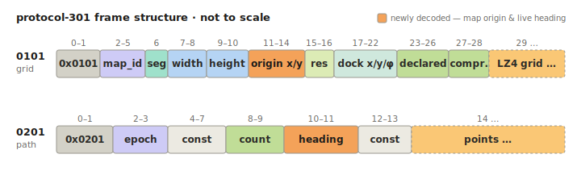

# Roborock Q10 (B01) — protocol notes + a working CLI


Notes from reverse-engineering how the Roborock Q10 S5+ talks to Roborock's cloud, plus `vac.py` — a
**validated reference implementation** of those findings (a single-connection daemon that dodges the account
`135` rate-limit, live telemetry taps, map decode, structured `--json` output), not just a proof of concept.
The Q10 S5+ is a **"B01" device: cloud-only**, with no local-network
control path; every command is relayed through Roborock's MQTT broker (or its REST API).

## Quickstart

**Requires Python 3.11+.** On 3.9/3.10, `pip` silently installs an old release with no Q10 support — check
`python3 --version` first (details under [Setup](#setup)).

```bash
git clone https://github.com/andrewlyeats/roborock-q10-cli.git && cd roborock-q10-cli
pip install -r requirements.txt # needs Python ≥3.11 — see the install gotcha under Setup
./vac.py login --email you@example.com # emails you a 6-digit code
./vac.py discover # caches your device list
./vac.py daemon start --careful # holds ONE cloud connection (recommended — see "Be gentle" below)
./vac.py status # battery, state, fan/water/mode, clean progress
./vac.py map # render the floor plan -> map_rooms.png
```

That's the whole happy path. The daemon holds a single connection so repeated commands can't trip the
account-level `135` rate-limit (which locks out the phone app too). A one-off without it is also fine —
`./vac.py status --force` opens its own session; just don't hammer it. The cleaning **path** only renders
while a clean is in progress (the room **grid** renders any time, even docked). More under **Setup** and
**Daemon** below.

<table>
<tr>
<td align="center" width="420"><a href="FRAME_ANATOMY.md"></a></td>
<td>
<b><a href="FRAME_ANATOMY.md">Decoding the map stream — read the frame anatomy →</a></b><br><br>
The Q10 streams its map as binary <b>protocol-301</b> frames. We decode the room grid and the robot's
path, and have reverse-engineered <b>most</b> of the frame header byte-by-byte (including a newly-found
map-finalized flag and the map origin fields at bytes 11–14). The decoder reads the map origin straight from the header — auto-fit is now just a fallback.<br><br>
<a href="FRAME_ANATOMY.md"></a>
</td>
</tr>
</table>

**Want a GUI?** The [Home Assistant Roborock integration][ha] probably already covers your vacuum — if
that's all you need, use it. **Want a terminal / cron / scripting tool, or to understand and extend the
B01 protocol?** That's what this is: the **Quickstart** above gets you to a rendered map in a few commands;
the protocol-reference hub for extenders is **[PROTOCOL.md](PROTOCOL.md)** — with findings not publicly documented to our knowledge, like the REST **Hawk body-signing** rule that gates every cloud write (see [the deep end](#understanding-the-protocol-the-deep-end) below).

## ⚠️ Disclaimer

This is an **unofficial**, community reverse-engineered tool — **not affiliated with, endorsed by, or
supported by Roborock**. It talks to your own account over Roborock's cloud and relies on undocumented
internals the vendor can change at any time. A personal project, provided **as-is, no warranty, no support,
use at your own risk.**
Commands are reversible and the project errs toward safety (e.g. `clean-rooms --dry-run` posts a
*disabled* job), but you are responsible for your device and account — don't run it on hardware or an
account you can't afford to disrupt.

## Tested hardware

| Item | Tested |
|---|---|
| Model | Roborock Q10 S5+ (`roborock.vacuum.ss07`, B01 protocol) |
| Firmware | **last validated against 03.11.24** (2026-06) |
| Python | 3.11 (3.11+ required) · `python-roborock` 5.14.2 (locked; upstream now 5.22.0) |

Other Roborock models are **untested** — they may share the B01 protocol (in which case much of this
should work) or differ. Reports from other models are welcome ([CONTRIBUTING.md](CONTRIBUTING.md)).
Firmware updates can drift from what's documented here.

## Setup

Needs Python **≥3.11** and the deps in `requirements.txt` (python-roborock, lz4, Pillow):
`pip install -r requirements.txt` (or `requirements.lock.txt` for the exact known-good pins, or
`pip install .` to use the `pyproject.toml` — which enforces Python ≥3.11 and installs a `vac` command).

> **The one install gotcha:** python-roborock 5.x requires Python ≥3.11. On 3.9/3.10 (e.g. macOS
> system `python3`) `pip` silently installs an old 0.x that lacks the B01 device modules — which looks
> like "the library is broken." Run `vac.py` on a ≥3.11 interpreter that has the deps. Note `./vac.py`
> uses your PATH's `python3` (shebang `env python3`) — confirm `python3 --version` is ≥3.11, or use the
> `vac` command from `pip install .`, which enforces it.

First-time auth (one time):

```bash
./vac.py login --email you@example.com # emails you a 6-digit code
./vac.py discover # fetches + caches your device list
```

`login` saves a token to `~/.roborock_vac.json` (gitignored; schema in
[`credentials.example.json`](credentials.example.json)); `discover` caches device/home data to
`~/.roborock_vac_cache.pkl` so later calls don't re-hit the cloud.

> **Be gentle with the cloud.** Many separate MQTT connections in a short window trip an account-level
> rate-limit (`code 135`) that locks out the CLI *and* the app for a while. The **daemon** (below)
> holds a single connection so this can't happen — it's the recommended way to use this tool.

## Daemon

A small background daemon holds **one** persistent cloud connection and serves every command over a
local socket, so commands don't each reconnect (and can't trip `135`). When one is running it's the
default path; if it isn't, commands print how to start it. It's **validated live** — one held
connection served reads, taps, and an hour of cleans without reconnecting. (The `135` rate-limit a single held connection
sidesteps — and why that's the safe design — is in [PROTOCOL.md](PROTOCOL.md#transport); the
`--careful` flag is shown in the daemon examples just below.)

```bash
./vac.py daemon start --careful # recommended: holds one connection, stops on the first 135/auth complaint
./vac.py daemon status # device, health, last update, taps
./vac.py daemon stop
./vac.py daemon restart # e.g. after `pip install -U python-roborock`
./vac.py status --force # run ONE command standalone (own session; avoid repeating)
```

**Headless (Linux/systemd) — experimental:** a conservative [`roborock-vac.service`](roborock-vac.service)
is included for running the daemon under `systemd --user`. *(Provided as-is: the daemon and its exit codes
are tested, but the unit itself hasn't been run under a live `systemd` here.)* It's **fail-stop** — it runs `--careful` and **never
auto-restarts on a rate-limit/auth exit** (better to stop than risk the `135` ban); only an unexpected
crash restarts, capped at 3×/hour. `daemon run` exits with distinct codes (75 rate-limit · 77 re-login
needed · 69 unreachable) so a unit or monitor can react. Edit the path, drop it in
`~/.config/systemd/user/`, enable.

**Telemetry taps** (the daemon sees the whole stream, so capture lives there — opt-in, off by default):

```bash
./vac.py daemon record --events ev.jsonl # every decoded data-point
./vac.py daemon record --novel new.jsonl # first-seen DP names (catch new behaviors)
./vac.py daemon record --bytes raw.jsonl # raw frames (incl. binary/map)
./vac.py daemon record --off
```

## Usage

Everyday commands:

```bash
./vac.py status # battery, state, fan, water, mode, clean time/area (+--json)
./vac.py status --quick # fast status via REST device-shadow — no MQTT/daemon (legacy v1 dps; +--json)
./vac.py start | pause | resume | stop | dock | dock-empty | find
./vac.py rooms # list rooms on the current map (id + name)
./vac.py clean-rooms kitchen study # clean only those rooms — REST job, ~2 min (+--fan/--water/--route/--count)
./vac.py clean-rooms kitchen --mqtt # instant MQTT segment-clean (each room uses its saved settings)

./vac.py fan turbo # quiet | balanced | turbo | max | max_plus
./vac.py water high # off | low | medium | high
./vac.py mode vac_and_mop # vac_and_mop | vacuum | mop
./vac.py consumables # brush/filter/sensor life counters (+--json)
./vac.py dnd on --start 22:00 --end 08:00 # also: dnd off

# Map edits (no robot motion — string-key COMMON write surface):
./vac.py zone list | add <no-go|no-mop|threshold> x1 y1 x2 y2 | clear # no-go/no-mop zones (DP 54) ✅
./vac.py wall list | add x1 y1 x2 y2 | clear # virtual walls (DP 56) ✅
./vac.py multimap list # list saved maps (read-only)

# Cloud schedules (stored server-side via the REST API):
./vac.py schedule list # id · time · rooms · fan/water
./vac.py schedule add --time 09:00 --days mon,wed,fri --rooms kitchen study
./vac.py schedule enable|disable|delete <id>
```

Capture & decode (the reverse-engineering surface):

```bash
./vac.py watch # live table of the modeled status fields (out clean.csv for CSV)
./vac.py watch --raw --out clean.jsonl # EVERY decoded data-point, one JSON object per line
./vac.py map # floor plan -> map_rooms.png (grid renders anytime; +map_path.svg only during a clean)
./vac.py watch --bytes --out cap.jsonl && ./decode_map.py cap.jsonl # low-level: byte capture -> offline decode
./decode_map.py cap.jsonl --json # structured data (rooms, robot position + current room, path, georef) -> stdout, pipe to jq
./vac.py history # fetch + decode the per-clean back-catalog live (op:list, ~25 records)
./vac.py history --from-capture clean.jsonl # ...or decode it offline from a capture
./vac.py raw STATUS # send any raw B01 data-point (run `raw BADNAME` to list them)
./vac.py raw --common <DP> '<json>' # wrap as COMMON{DP:val} (robot input channel) vs a bare send — write-path probe
./vac.py drive forward # manual remote drive (forward|left|right|stop|exit) — ✅ validated live (moves the robot; drive in a clear space)
```

Multiple robots? Add `--device <duid>` (DUIDs via `./vac.py discover`). Most B01 commands are
fire-and-forget (no response body); `raw` is the escape hatch for features without a dedicated command.

## Autonomy layer (experimental)

Separate from the CLI, a small standalone toolset builds *on top of* the same cloud-MQTT comms to do
things the robot exposes no native command for — heading-aware **go-to** (`nav.py`), **on-demand lidar**
snapshots (`scan.py` — no clean, no motion), live **pose + SLAM-heading** readout
(`pose_extract.py` / `pose_monitor.py`), and a lost→remap→**recover** flow (`recover.py`). It's kept
deliberately *out* of `vac.py` (a candidate for its own sister project).

> ⚠️ **Experimental** — newer and less battle-tested than the CLI; interfaces may change. `nav.py` /
> `recover.py` **move the robot with no AI/laser obstacle avoidance** (hardware bumper/cliff failsafes
> under `REMOTE` are unverified) — supervise every run, clear the area, and keep it away from stairs/drop-offs.

What each tool does, validated metrics, and what's still gated → **[AUTONOMY.md](AUTONOMY.md)**.

## Known limitations

- **Cloud-only.** No local control for this model (B01 protocol).
- **Map.** `vac.py map` renders the room grid (colour-coded, room-name-labeled). The grid streams
  even while docked; the cleaning path + live position stream during a clean (and other active navigation). Georeference:
  grid dimensions and the map origin are read straight from the frame header (origin at bytes 11–14, `x_min`/`y_min`, verified) → `map_overlay.png` (auto-fit is retained only as a fallback). **AI-obstacle markers (the "cones"), erase / no-go areas, and carpet zones are also decoded from the map frame and rendered** — they live in sections after the grid that most decoders drop. Only obstacle *photos* are cloud-side, and this model has no camera. The library exposes none of this natively.
- **Room cleaning** (`clean-rooms`) has two paths. **`--mqtt`** runs an **instant** MQTT segment-clean
  (no Hawk; each room cleans with its *saved* fan/water/mode) — the direct way to clean specific rooms now.
  The default posts a one-time REST `/jobs` job that fires **~2 min later**, but it carries per-job
  `--fan`/`--water`/`--route`/`--count` and is the path the app uses for *scheduled* cleans; `--dry-run`
  posts a *disabled* job (can't fire even if the delete races). A complete cycle (undock → clean → dock →
  charging) is validated live. The `/jobs` body schema is in [PROTOCOL.md](PROTOCOL.md).
- **Virtual walls (DP 56) and no-go/no-mop zones (DP 54) can be set** — `wall`/`zone` add/clear, validated
  live (wall-SET round-trip 2026-06-19; zone-SET). Room split/merge/rename decode but aren't settable yet.
- **Most stored settings are settable** (volume, child-lock, boost, DND, dust, route, carpet) via the
  string-key COMMON envelope — an earlier interpretation saw writes revert; that was a wire-format bug. A couple
  (`BREAKPOINT_CLEAN`, `MAP_SAVE_SWITCH`) don't stick. Runtime settings (fan/water/mode) persist.
- **Consumables** show hours used + % remaining (confirmed against the app: main 300 h / side 200 h /
  filter 150 h).

## Understanding the protocol (the deep end)

*How this was done: the cloud write surface was cracked not by intercepting the network but by running the
Roborock app in an Android emulator and watching its own traffic.*

For the protocol itself, the reference hub is **[PROTOCOL.md](PROTOCOL.md)** — transport · auth/Hawk ·
data points · map frames · capabilities, every claim tagged with a confidence tier + firmware/session
provenance, dated "as of." The byte-by-byte map-frame walkthrough is **[FRAME_ANATOMY.md](FRAME_ANATOMY.md)**
(with a machine-readable Kaitai header schema, [frames.ksy](frames.ksy), you can drop your own capture into,
plus a machine-readable data-point index, [datapoints.json](datapoints.json), and structured map/position
output via `decode_map.py --json` — so a status panel or web UI can consume the decode, not just a PNG).
The highlights:

- **The B01 map format** — the room grid is LZ4-compressed; path/position arrive as protocol-301
  frames. Decoded end-to-end into a labeled floor plan — grid dimensions and the map origin (bytes 11–14, verified ✅) read straight from the frame header; auto-fit is retained only as a fallback.
  The frame's post-grid **vector layers** — AI-obstacle markers, erase/no-go areas, and carpet — are decoded
  too (most parsers, including the library's, stop at the occupancy grid).
  *(Not a sole source: python-roborock [PR #848] is converging on a similar auto-fit solve — read this
  as an independent, dated corroboration, with the provenance write-up as the durable part.)*
  → [FRAME_ANATOMY.md](FRAME_ANATOMY.md), [PROTOCOL.md](PROTOCOL.md), [`decode_map.py`](decode_map.py)
- **The cloud write path** — schedule writes (and one-time `/jobs` room cleans) go through a REST `/jobs` call that needs
  **Hawk *body* signing**; getting that wrong looks exactly like "writes don't work / token scope,"
  but it isn't. This one wasn't publicly documented when we hit it; we filed [issue #849] and the fix
  **shipped upstream as PR #852** (`python-roborock` 5.15.2) — our first contribution. → [PROTOCOL.md](PROTOCOL.md)
- **A single-connection daemon** — one held MQTT connection serving every command, to stay under the
  account-level `135` rate-limit that otherwise locks out the CLI *and* the app. *(As upstream gains
  held-connection / MQTT segment-clean paths, the practical edge narrows; the documented 135-avoidance
  **design + the "why"** is the lasting bit.)* → [PROTOCOL.md](PROTOCOL.md#transport)
- **The B01 data-point dictionary** — what each data-point means and how its payload decodes (114 in
  the library catalog; **~66** ever seen across all sessions; ~19 surfaced in `status`). → [DP_DICTIONARY.md](DP_DICTIONARY.md)

**How this relates to upstream.** Basic Q10 control/status/sensors are already in `python-roborock` +
Home Assistant core, and map/georef/wall-zone decode is **converging fast in python-roborock** — community
PRs [#847] (merged) + [#848]/[#851] (open), alongside our own contributions. **Merged:** the **Hawk `/jobs`
body-signing** fix (our PR [#852], 5.15.2), the **`remote_trait`** inner-key fix (PR [#854]), and a **Q10 zone
type-2/3** type-code correction to community PR [#850] (5.18.0). **Open / proposed:** the **clean-record history**
decode (PR [#857], under review) and the map-package **obstacle / erase / carpet layers** (a follow-up comment on
PR [#848]). The decode/map parts here overlap that work — a dated, independent take on the same ground. What's least
covered elsewhere: the **confidence-tagged protocol reference**, the **firmware SLAM heading** (`0201`
offset-10), and the **closed-loop nav** built on it. We've upstreamed what fits the library and hope the
reference is useful to anyone building on B01.

What's been verified vs. still open is scoped in [CAPABILITIES.md](CAPABILITIES.md) (can / can't /
unknown).

## Built on / related projects

An unofficial CLI + daemon built on others' work — full credits in [CREDITS.md](CREDITS.md):

- [python-roborock][pr] — the library this depends on.
- [Home Assistant Roborock integration][ha] — the single-connection coordinator pattern the daemon follows.
- [local_roborock_server](https://github.com/Python-roborock/local_roborock_server) /
  [Valetudo](https://github.com/Hypfer/Valetudo) — if you want a full *local* cloud replacement instead.
- [XiaomiRobotVacuumProtocol](https://github.com/marcelrv/XiaomiRobotVacuumProtocol),
  [dustcloud](https://github.com/dgiese/dustcloud) — the protocol-RE lineage.

## Contributing & license

Contributions — especially reports from other Roborock models — are welcome
([CONTRIBUTING.md](CONTRIBUTING.md)). Before testing against a live robot, read the **Be gentle with
the cloud** note above. Licensed under the [MIT License](LICENSE).

## Built with AI assistance

Developed with AI coding assistants (Anthropic's Claude Opus 4.8 and Claude Sonnet 4.6) under human
direction — code, reverse-engineering, and docs. A human reviewed the work and ran every live test
against the real device. See [CREDITS.md](CREDITS.md).

[ha]: https://www.home-assistant.io/integrations/roborock/
[pr]: https://github.com/Python-roborock/python-roborock
[PR #848]: https://github.com/Python-roborock/python-roborock/pull/848
[issue #849]: https://github.com/Python-roborock/python-roborock/issues/849
[#847]: https://github.com/Python-roborock/python-roborock/pull/847
[#848]: https://github.com/Python-roborock/python-roborock/pull/848
[#850]: https://github.com/Python-roborock/python-roborock/pull/850
[#851]: https://github.com/Python-roborock/python-roborock/pull/851
[#852]: https://github.com/Python-roborock/python-roborock/pull/852
[#854]: https://github.com/Python-roborock/python-roborock/pull/854
[#857]: https://github.com/Python-roborock/python-roborock/pull/857
